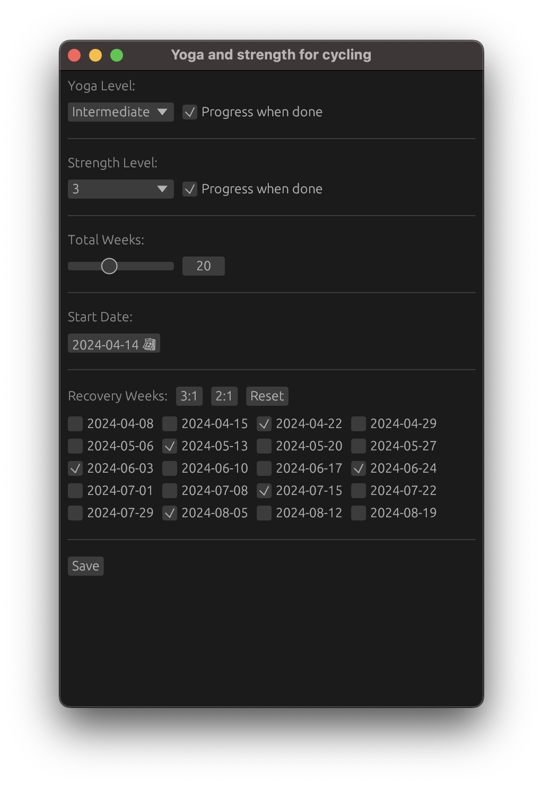

# Yoga and Strength Calendar Event Creator
App for creating an icalendar file for strength and yoga training in connection to a cycling workout.
This was created to work well with TrainerRoad as supplementary workouts/stretches.  The name of each
event corresponds to a Wahoo SYSTM video.
  
## Compiling
Rust or pyton installation needed.  For the python versions `./python`,
with workout.tk.py being the GUI version.  For Rust, compile with `cargo build --release`

## Use
Rust:

